# oop-master

## Disadvantage of Procedural Programming

Procedural Programming is good, but there is some serious issue we face to programming seems really hard when it comes to procedural programming like C.

1. Code is not reusable.
2. Large code base is hard to manage.
3. Difficult to tracing & fixing bugs.
4. Data is exposed to whole program.
5. Here, operation's priority is higher than data.
6. Difficult to relate with real world data.

OOP:

```java
Public String name
Public String email
Public String password
Public String username

User createUser (data) {};
void login(data) {};
void logout() {};
void resetPassword(data) {};
```

- Now User is a Template or Constructor Function
- We can call User function as many time as we want.
- Each time we call User a new User will be create. For example: new User(data)

```java
User user1 = new User(data);
User user2  = new User(data)
```

## Class is a template to create multiple Object

- Class i a Blueprint to create multiple Object.

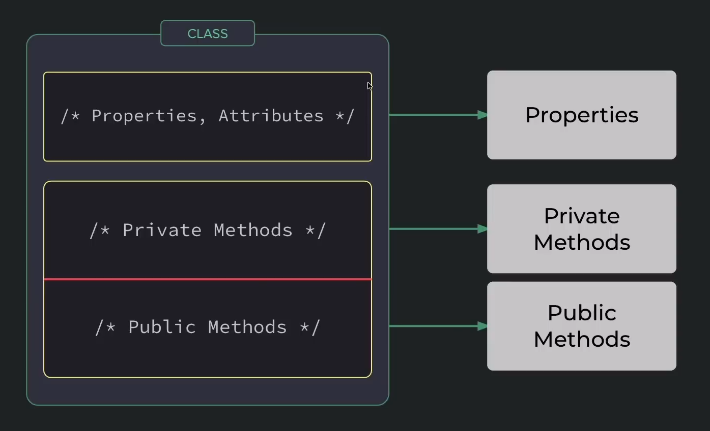

## Object Oriented Programming is all about Object

- Anything that need multiple attributes or multiple primitives to define.
- Object is king in OPP.

## Every Thing as a Object

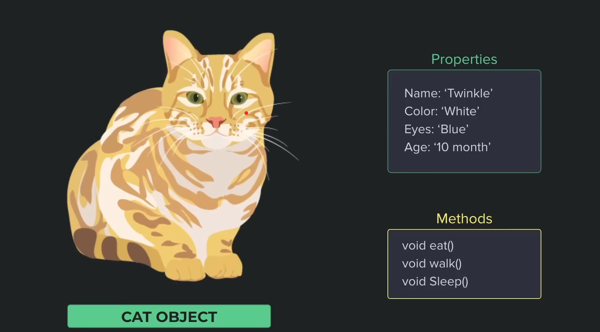

## What is an Object?

1. Combination of Noun, Adjective & Verb.
   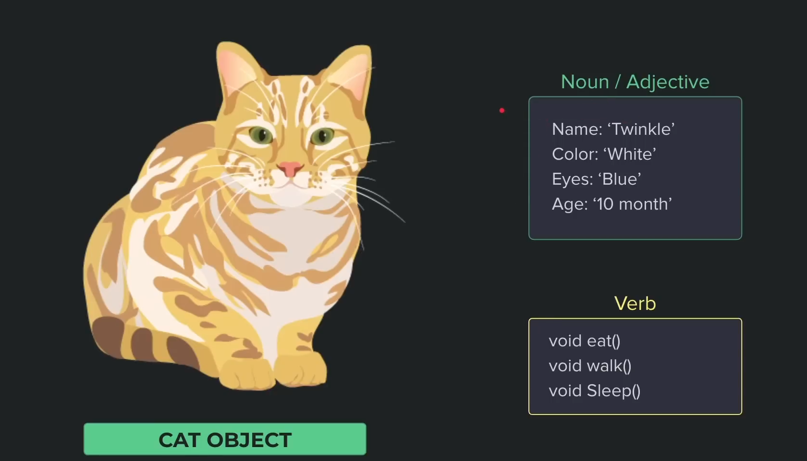
   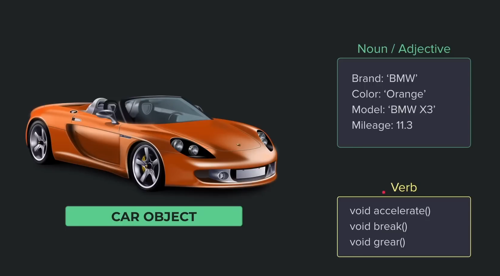
2. A Capsule that can encapsulate data & operations.
3. Has some private and public properties.
4. Has some functions which is called methods.
5. Is a custom data type.
6. An isolated environment for properties & method.

## Components of a class

1. Constructor
2. State(properties/ attributes)
3. Methods
4. Static States
5. Static Methods

## OOP has four main pillar

**Abstraction**

- Abstraction means hiding the implementation details inside and providing just the necessary API. We never know how it is working, we only know what to do.

**Encapsulation**

- The definition of encapsulation is "the action of enclosing something in or as if in a capsule". Encapsulation means that each object in your code should control its own state. State is the current "snapshot" of your object.

```java

class Person {
   // private state
   private String name;

   // public static state
   public static int key;

   // public method
   public Person (String name) {
      this.name = name;
   }

   public String getName() {
      return this.name;
   }

   // public static method
   public static Person create(String name) {
      return new Person(name);
   }
}
```

**Inheritance**

- The ability of creating a new class from an existing class. Inheritance is when an object acquires the property of another object. Inheritance allows a class to acquire the properties and behavior of another class.

**Polymorphism**

- Polymorphism is derived from 2 Greek words: ply and morphs. The word "poly" means many and "morphs" means forms. So polymorphism means "many forms".

## There are two types of relation in OOP

**Is a relation**

- Inheritance

**Has a relation**

- Composition
- Aggregation

## Inheritance( Is a relation)

Inheritance is the ability of creating a new class from an existing class. Inheritance is when a object acquires the property of another object. **Inheritance allow a class to acquire the properties and behavior of another class.**

**Inheritance means, Is a relationship.**

> **Before Inheritance**

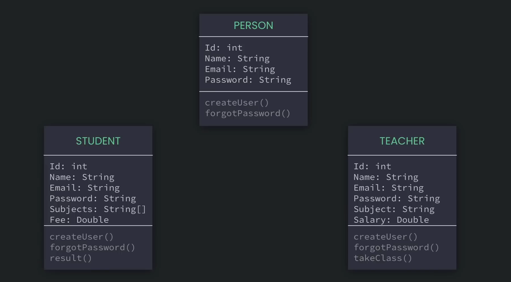

> Analyzing Common Properties and Methods

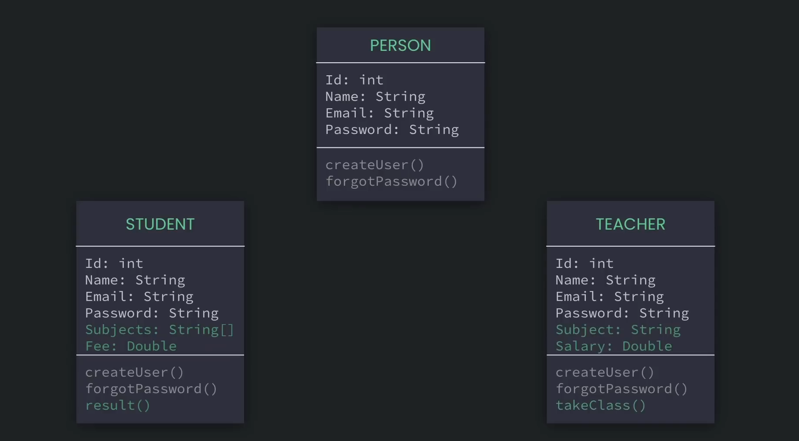

> **After Inheritance**

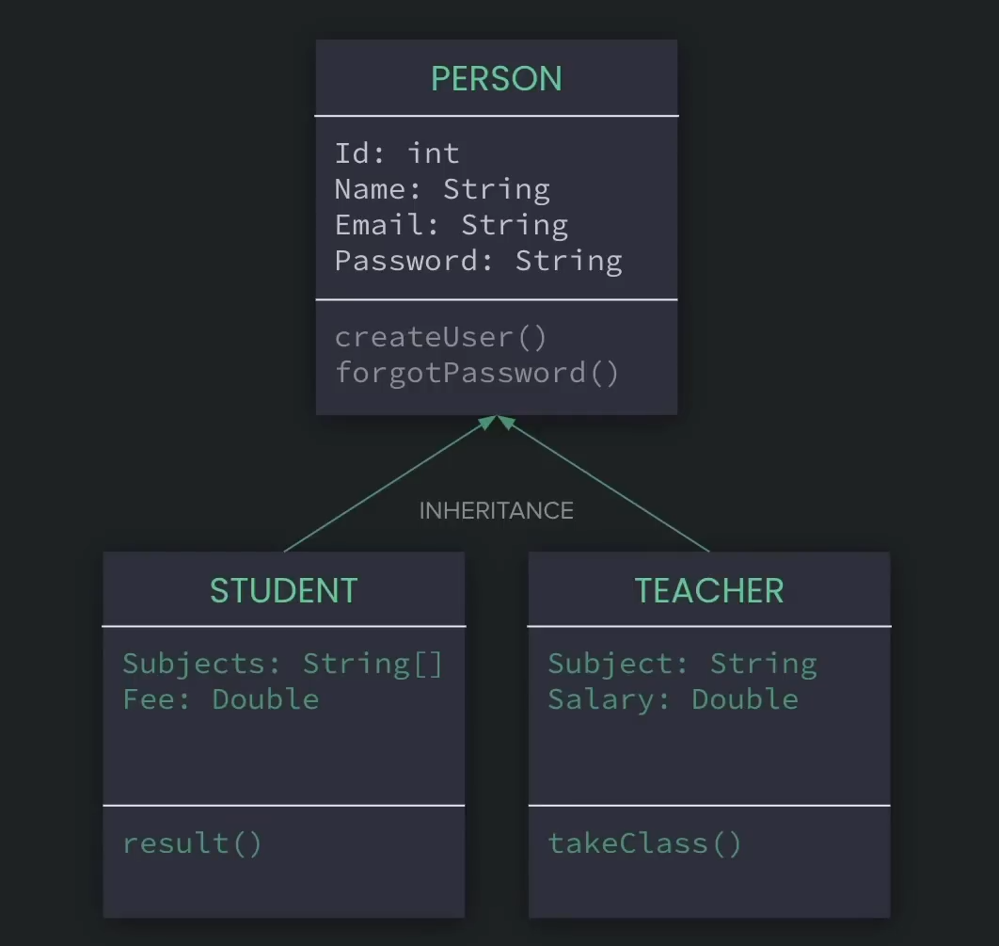

> **Complex Example of Inheritance**

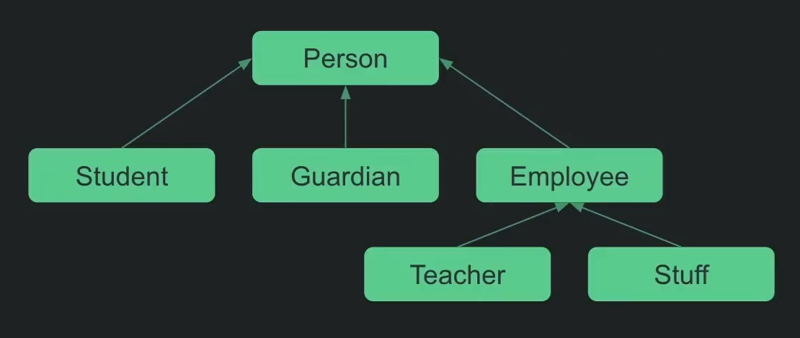

## Aggregation( Has a relation)

**Aggregation means, Has a relationship.**

- যেখানে child independently থাকতে পারবে সেটা হলো aggregation(Aggregation is where a child can live independently).
  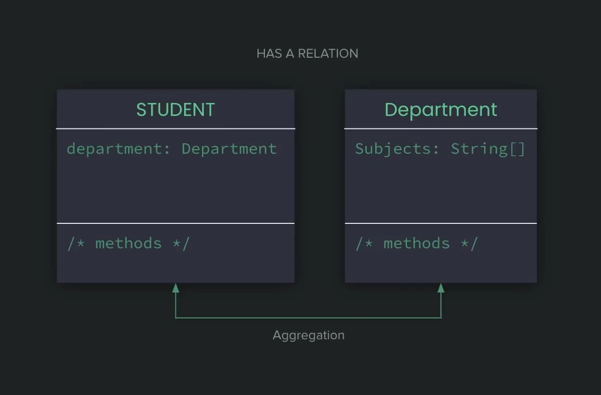

## Composition( Has a relation)

**Composition means, Has a relationship.**
-যেখানে child independently থাকতে পারবে না সেটা হলো composition(Where a child cannot be independent is composition).

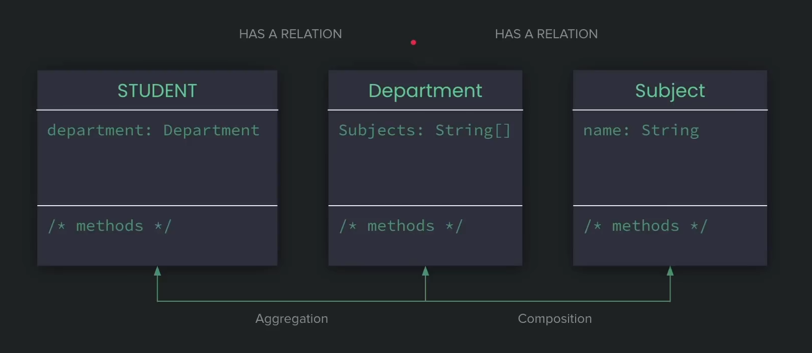

## Polymorphism

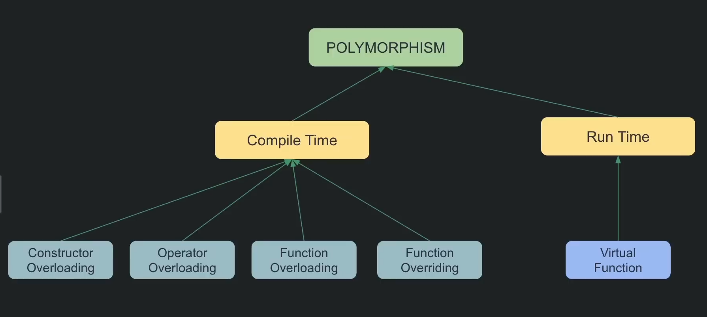
